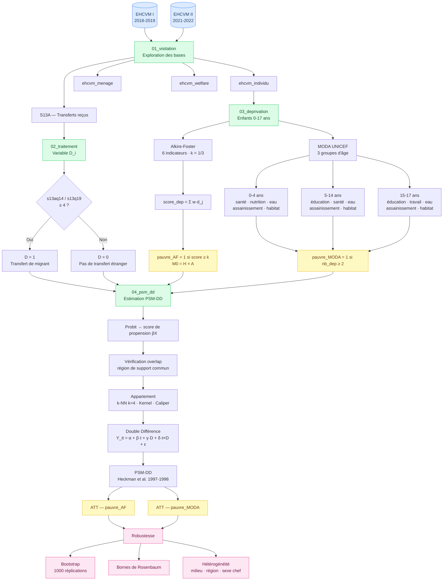

# Mémoire de fin d'études — ENSAE Pierre Ndiaye

**Titre :** Impact des transferts de migrants sur la pauvreté multidimensionnelle des enfants au Sénégal

**Auteur :** Sié Rachid TRAORÉ — Élève Ingénieur Statisticien Économiste (ISE)

**Institution :** École Nationale de la Statistique et de l'Analyse Économique (ENSAE Pierre Ndiaye), Dakar

**Année académique :** 2025-2026

---

## Pipeline d'analyse



---

## Résumé

Ce mémoire analyse l'impact des transferts de fonds des migrants sur la pauvreté multidimensionnelle des enfants au Sénégal. La mesure de la pauvreté repose sur deux approches complémentaires : la méthode **Alkire-Foster** (IPM-Enfant) et l'approche **MODA** (Multiple Overlapping Deprivation Analysis) développée par l'UNICEF. La stratégie d'identification mobilise un estimateur **PSM-DD** (Heckman et al., 1997/1998), permettant de contrôler à la fois les biais de sélection observables et les effets fixes inobservables invariants dans le temps.

**Données :** EHCVM I (2018-2019) et EHCVM II (2021-2022) — Enquête Harmonisée sur les Conditions de Vie des Ménages, ANSD/Banque Mondiale.

---

## Structure du dépôt

```
MEMOIRE/
├── latex/                        # Source LaTeX du mémoire
│   ├── main.tex                  # Fichier principal (compiler avec pdflatex + biber)
│   ├── references.bib            # Bibliographie (BibLaTeX/APA)
│   ├── chapitres/                # Chapitres et pages liminaires
│   │   ├── introduction.tex
│   │   ├── chapitre1.tex         # Revue de littérature
│   │   ├── chapitre2.tex         # Méthodologie (AF, MODA, PSM-DD)
│   │   ├── chapitre3.tex         # Statistiques descriptives
│   │   ├── chapitre4.tex         # Résultats et discussion
│   │   └── conclusion.tex
│   ├── styles/pagedeGarde.tex
│   └── annexes/
│
├── code/
│   ├── R/
│   │   ├── config.R              # Chemins, packages, constantes
│   │   ├── utils.R               # Fonctions utilitaires
│   │   ├── 01_visitation.R       # Exploration des bases
│   │   ├── 02_traitement.R       # Variable D (transferts migrants)
│   │   ├── 03_deprivation.R      # Indicateurs AF + MODA
│   │   ├── 04_psm_dd.R           # Estimation PSM-DD
│   │   ├── main.R                # Script maître
│   │   └── rapport.Rmd           # Rapport interactif
│   ├── stata/
│   │   ├── config.do · utils.do
│   │   ├── 01_visitation.do … 04_psm_dd.do
│   │   └── main.do
│   └── python/
│       ├── config.py · utils.py
│       ├── 01_visitation.py … 04_psm_dd.py
│       └── main.py
│
└── Base/                         # Données EHCVM (non versionnées)
    ├── 2018-2019/
    └── 2021-2022/
```

---

## Compilation LaTeX

```bash
cd latex
pdflatex main.tex
biber main
pdflatex main.tex
pdflatex main.tex
```

---

## Méthodologie

### Mesure de la pauvreté multidimensionnelle

| Approche | Référence | Groupes d'âge | Indicateurs |
|----------|-----------|---------------|-------------|
| Alkire-Foster (M0 = H × A) | Alkire & Foster (2011) | 0-17 ans | 6 indicateurs, seuil k = 1/3 |
| MODA (UNICEF) | De Neubourg et al. (2012) | 0-4 / 5-14 / 15-17 ans | Déprivations spécifiques par âge |

### Variable de traitement

Construite à partir de la **section S13A** de l'EHCVM :

| Code `s13aq14` / `s13q19` | Lieu de résidence expéditeur | Traitement |
|---------------------------|------------------------------|-----------|
| 1 | Même ville/village | D = 0 |
| 2 | Même région | D = 0 |
| 3 | Ailleurs au pays | D = 0 |
| ≥ 4 | Pays étranger (Bénin, France, Espagne…) | **D = 1** |

---

## Données

Les fichiers de données brutes (EHCVM) ne sont pas versionnés dans ce dépôt. Disponibles auprès de l'ANSD ou via le portail Banque Mondiale (MICRODATA).

---

## Contact

**Sié Rachid TRAORÉ** — sierachidtraore@gmail.com
